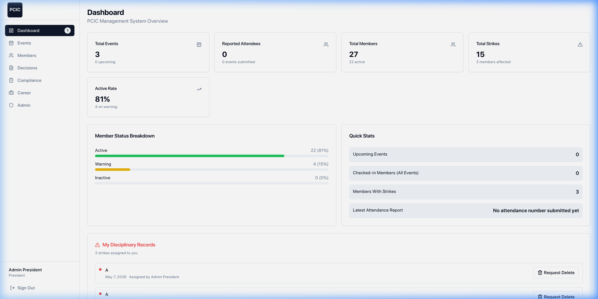
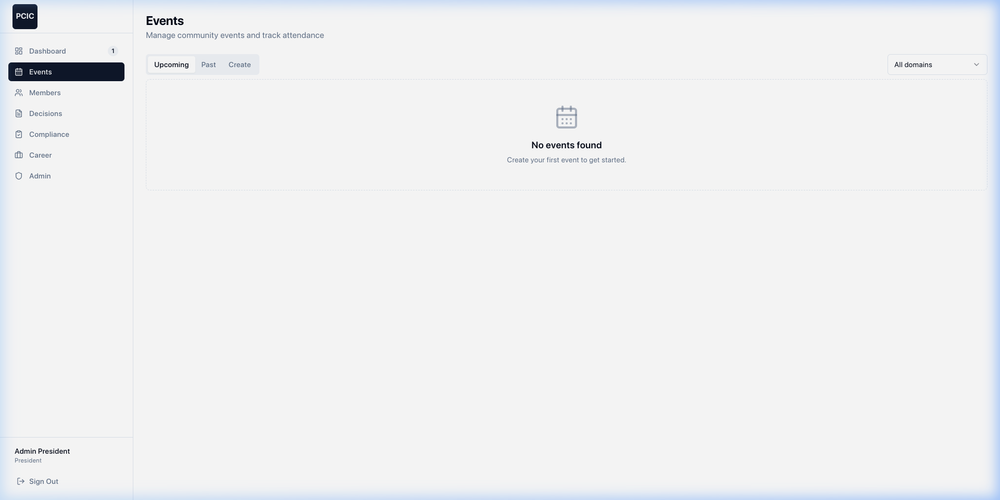
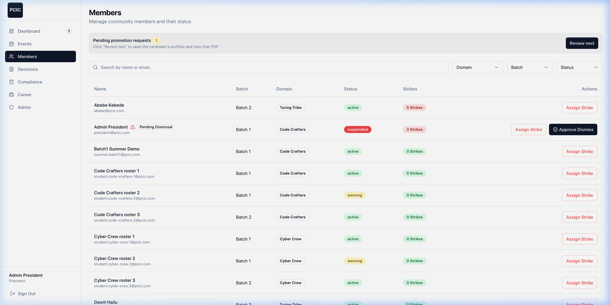
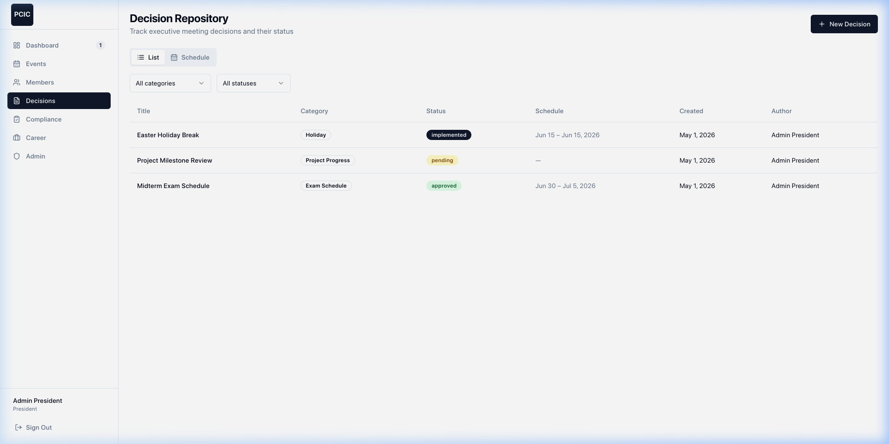
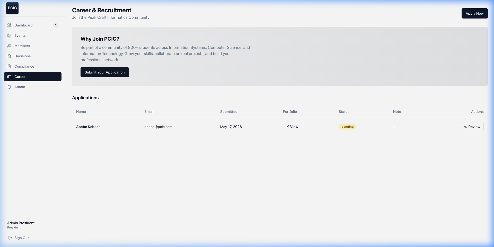
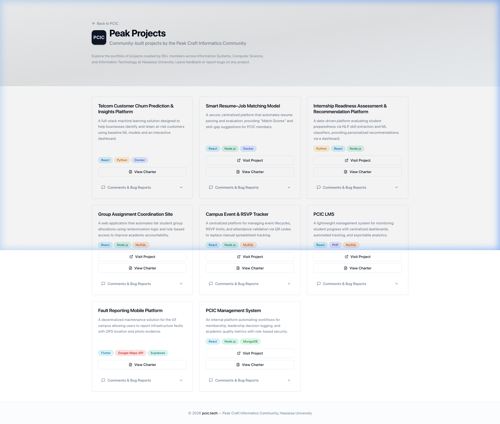
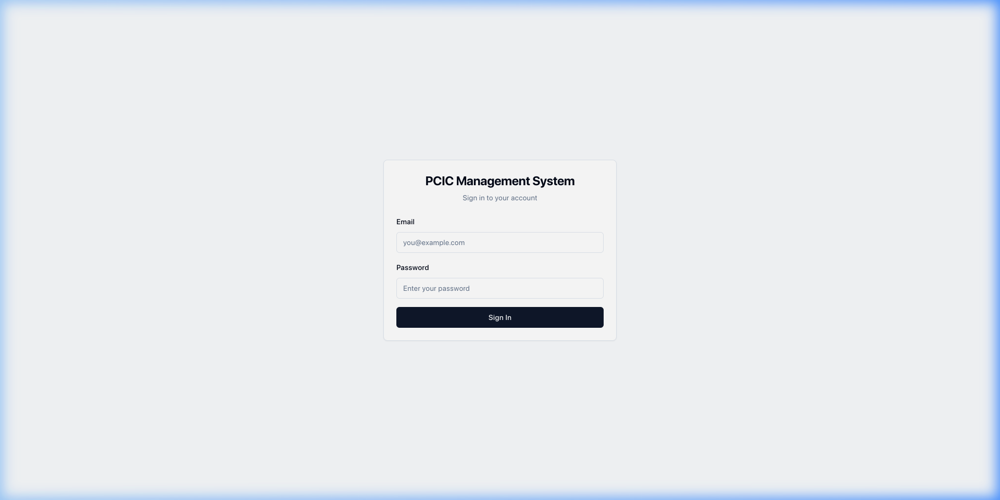

# PCIC Internal Management System

Web platform for the **Peak Craft Informatics Community** (PCIC) — digitizing membership tracking, event attendance, leadership decision-making, and disciplinary workflows for 800+ members across IS, CS, and IT departments at Hawassa University.

🌐 **Live:** [pcic.tech](https://pcic.tech) &nbsp;|&nbsp; 📄 **Projects:** [pcic.tech/peak-projects](https://pcic.tech/peak-projects)

## Screenshots 

| | |
|---|---|
|  **Dashboard** — Overview with stats, member breakdown, and quick actions |  **Events** — Create and track attendance by domain |
|  **Members** — Filter, search, and manage 800+ members |  **Decisions** — Log and track executive decisions |
|  **Career & Recruitment** — Candidate applications and approval |  **Peak Projects** — Public project showcase with comments |

<details>
<summary>Login Page</summary>


</details>

## Tech Stack

| Layer | Technology |
|-------|-----------|
| Frontend | React 18 (JSX) + Vite + Shadcn UI + Tailwind CSS |
| Backend | Node.js + Express.js (ES modules) |
| Database | MongoDB + Mongoose |
| Auth | JWT + bcryptjs |
| File Storage | Cloudinary |
| Hosting | GitHub Pages (frontend) + Vercel (backend API) |

## Quick Start

### Prerequisites

- **Node.js 20 LTS or 22 LTS** (avoid v24 — known TLS issues with MongoDB Atlas)
- **MongoDB** — the team uses a shared [MongoDB Atlas](https://www.mongodb.com/atlas) cluster
- **Git**

### 1. Clone and install

```bash
git clone <repo-url>
cd PCIC

# Install all dependencies (client + server) in one command
npm run setup
```

### 2. Configure environment

```bash
cd server
cp .env.example .env
```

Edit `server/.env` with your credentials (ask the team lead for the shared Atlas connection string):

```env
MONGODB_URI=<your-atlas-connection-string>
JWT_SECRET=<random-secret-string>
PORT=5000

# Cloudinary (required for file uploads)
CLOUDINARY_CLOUD_NAME=<your-cloud-name>
CLOUDINARY_API_KEY=<your-api-key>
CLOUDINARY_API_SECRET=<your-api-secret>
```

> **Atlas setup (first time only):** Go to [Atlas Network Access](https://cloud.mongodb.com/) and add your IP address. Without this, connections will fail with a TLS error.

### 3. Seed test data (optional but recommended)

```bash
cd server
npm run seed
```

If you **keep an existing database** after pulling changes that narrowed `User.domain` / `Event.domain` to the four PCIC domains, run once:

```bash
cd server
npm run migrate:domains
```

After seeding, run tests:

```bash
cd server
npm test
```

> **Note:** The seeder creates test accounts for every role. See `server/src/seed.js` for the full list of credentials.

### 4. Run

```bash
# Terminal 1 — Backend API (port 5000)
cd server && npm run dev

# Terminal 2 — Frontend (port 5173)
cd client && npm run dev
```

Open http://localhost:5173 and log in with a seeded account.

## Project Structure

```
client/src/                     React frontend (Vite root)
  api/axios.js                  API client (JWT auto-attached)
  context/AuthContext.jsx       Auth state provider
  hooks/                        React Query hooks (useEvents, useMembers, etc.)
  components/ui/                Shadcn UI primitives
  components/{module}/          Feature components
  components/shared/            Reusable components (ProtectedRoute, RoleGate, etc.)
  pages/                        Page components
  App.jsx                       Router + sidebar layout

server/                         Express backend
  src/index.js                  App entry point
  src/config/db.js              MongoDB connection
  src/middleware/auth.js        JWT verification
  src/middleware/roleGuard.js   Role-based access
  src/models/                   Mongoose schemas
  src/controllers/              Route handlers
  src/routes/                   API route definitions
  src/utils/                    Email + Cloudinary upload helpers
  src/seed.js                   Database seeder
```

## Features

- **Event Attendance** — Create events, track check-ins by domain
- **Decision Repository** — Log and track executive decisions with status timeline
- **Strike System** — Search members, assign disciplinary strikes
- **Leadership Compliance** — Semester dashboard for Domain Leader report compliance
- **Accelerated Entry** — Candidate portfolio upload, president approval
- **Summer Projects** — Batch-based PDF submissions with Domain Leader grading
- **Member Management** — Filter, view profiles, change status (triggers email)
- **Peak Projects Showcase** — Public-facing portfolio of community-built projects with comment/bug-report system
- **Automated Reports** — Exportable analytics for leadership decisions and member activity

## User Roles

| Role | Stored Value |
|------|-------------|
| President | `president` |
| Vice President | `vice_president` |
| Secretary | `secretary` |
| Project Manager | `pm` |
| Membership Coordinator | `mc` |
| Event Team | `event_organizer` |
| Public Relations | `pr` |
| Domain Leader | `domain_leader` |
| Member | `member` |

## PCIC Domains

All members belong to one of four domains: **Code Crafters**, **Turing Tribe**, **Cyber Crew**, **Pixel Peeps**.

## Deployment

| Component | Platform | URL |
|-----------|----------|-----|
| Frontend | GitHub Pages | [pcic.tech](https://pcic.tech) |
| Backend API | Vercel | Private API endpoint |
| Database | MongoDB Atlas | Shared cluster |
| File Storage | Cloudinary | `pcic-uploads` folder |

### Deploy Frontend

```bash
npm run deploy   # Builds and pushes to gh-pages branch
```

### Deploy Backend

Push to the connected Vercel Git branch — auto-deploys on push.

## For Contributors

See [CONTRIBUTING.md](CONTRIBUTING.md) for coding standards, branch naming, and PR workflow.

## AI Assistant Context

This project includes configuration for AI coding assistants:

- **Any AI** — `AGENTS.md` at the project root
- **Cursor** — Rules in `.cursor/rules/`, skills in `.cursor/skills/`
- **GitHub Copilot** — Instructions in `.github/copilot-instructions.md`

These files ensure any AI assistant understands the project architecture, tech stack, and conventions.